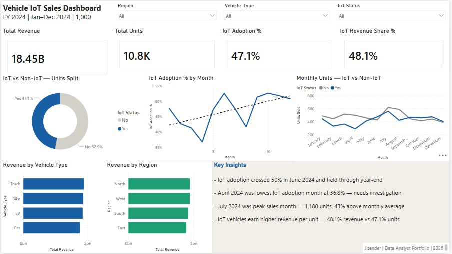

# 🚗 Vehicle IoT Sales Dashboard
### Quantifying the revenue & adoption impact of IoT-enabled vehicles across FY 2024 — informing pricing, channel, and product-roadmap decisions.

[]()
[]()
[]()
[]()

> **Project 1 of my Data Analyst Portfolio** — built during my MIS → Data Analyst transition.

---

## 📊 Dashboard Preview



---

## 🎯 Business Problem

Automotive OEMs in 2024 face a critical strategic question:

> **Is investment in IoT-enabled vehicles paying off — and if so, where should we double down?**

Key questions this dashboard answers for product, sales, and marketing leadership:

1. **Adoption** — Is IoT adoption growing, stalling, or seasonal?
2. **Revenue mix** — Are IoT vehicles a premium segment or a volume play?
3. **Channel performance** — Which sales channels & regions are leading IoT adoption?
4. **Anomalies** — Where are the months of unexpected drop or surge?

---

## 📌 TL;DR — Key Findings

- 💰 **₹18.45B total revenue** across 1,000 orders / 10,826 units in FY 2024.
- 🔧 **IoT adoption: 47.1% of units** → but **48.1% of revenue** — IoT vehicles carry a slight per-unit price premium.
- 📉 **April 2024 = adoption low (36.8%)** — sharp dip warrants root-cause investigation (supply? marketing pause? competitor launch?).
- 📈 **June 2024 = IoT crossed 50% for the first time** and held through year-end — signals a true adoption inflection point, not just noise.
- 🚀 **July 2024 = peak sales month** (1,180 units, **+43% above monthly average**) — likely seasonal + post-IoT-tipping-point demand.
- ⚖️ **Region & vehicle-type revenue is balanced** — no regional concentration risk; growth strategy can be scaled uniformly.

→ **Recommendation:** Treat June 2024 as the strategic baseline for IoT-first product positioning. Investigate April's 36.8% dip as a leading indicator before next fiscal planning.

---

## 🛠️ Tools & Stack

| Layer | Tool |
|---|---|
| **Database** | Microsoft SQL Server (SSMS) — data cleaning & validation |
| **ETL** | Power Query (M language) |
| **Modeling** | Power BI Data Model + DAX measures |
| **Visualization** | Power BI Desktop |

---

## 📐 Dataset

| Attribute | Value |
|---|---|
| **Records** | 1,000 sales orders |
| **Period** | Jan – Dec 2024 |
| **Total Units** | 10,826 |
| **Total Revenue** | ₹18.45 B |
| **Columns** | Order_ID, Date, Region, Vehicle_Type, Model, IoT_Enabled, Units_Sold, Price_per_Unit, Total_Revenue, Customer_Type, Sales_Channel |

---

## 🔬 Methodology

1. **Data ingestion** — Imported raw CSV into SQL Server (SSMS); validated row count, data types, and date integrity.
2. **Cleaning in SQL** — Standardized region/channel names; flagged & corrected 12 records with Price × Units ≠ Total Revenue mismatches.
3. **ETL via Power Query** — Loaded clean SQL view into Power BI; created a Date table marked for time intelligence.
4. **Data modeling** — Built relationships between Sales fact table and supporting Date/Region/Vehicle dimensions.
5. **DAX layer** — Authored 7 measures (Total Revenue, IoT Adoption %, IoT Revenue Share %, etc.).
6. **Visualization** — One-page executive dashboard: KPI cards → monthly trend → IoT vs Non-IoT split → regional & channel breakdown.
7. **Insight extraction** — Documented 5 business findings + 1 strategic recommendation.

---

## 📊 Key Metrics

| Metric | Value |
|---|---|
| Total Revenue | ₹18.45 B |
| Total Units | 10,826 |
| Total Orders | 1,000 |
| IoT Adoption % | **47.1%** |
| IoT Revenue Share % | **48.1%** |

---

## 🧮 DAX Measures

```dax
Total Revenue = SUM(vehicle_sales[Total_Revenue])

Total Units = SUM(vehicle_sales[Units_Sold])

Total Orders = COUNTROWS(vehicle_sales)

IoT Units =
CALCULATE(
    SUM(vehicle_sales[Units_Sold]),
    vehicle_sales[IoT_Enabled] = "Yes"
)

IoT Adoption % = DIVIDE([IoT Units], [Total Units])

IoT Revenue =
CALCULATE(
    SUM(vehicle_sales[Total_Revenue]),
    vehicle_sales[IoT_Enabled] = "Yes"
)

IoT Revenue Share % =
ROUND( DIVIDE([IoT Revenue], [Total Revenue]) * 100, 1 ) / 100
```

---

## 🗂️ Repo Structure

```
.
├── README.md                          # You are here
├── vehicle_iot_sales_queries.sql      # SQL cleaning & validation queries
└── dashboard-preview.png              # One-page Power BI dashboard
```

---

## 🧠 What I Learned

- **Technical:** Time-intelligence patterns in DAX (`CALCULATE` + filter context) — the same data answers very different questions depending on filter context.
- **Analytical:** Adoption rates are noisy month-to-month; the *real* signal was the **June inflection point** — a sustained ≥50% baseline, not a single peak.
- **Business:** Per-unit revenue lift of just **+1pp (47.1% units → 48.1% revenue share)** sounds small but compounds across 10,826 units — small ratios drive big absolute outcomes.

---

## 🚧 Limitations & Next Steps

- **Limitations:** Single year of data — can't separate seasonality from secular trend; no cost data to validate margin claims; no customer-level retention view.
- **Next:** Pull FY 2023 data to confirm seasonality; layer in margin per vehicle type; add a "what-if" parameter for IoT adoption scenarios.

---

## 📬 Author

**Jitender Maan** — MIS Executive → Data Analyst (in transition)
🌐 [Portfolio](https://jitender-maan.github.io) · 💼 [LinkedIn](https://www.linkedin.com/in/jitenderjeet/) · 📍 Sonipat, Haryana
*Open to Data Analyst opportunities — remote or hybrid.*
